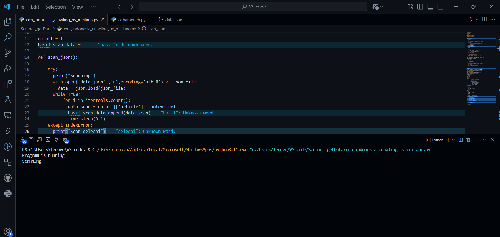
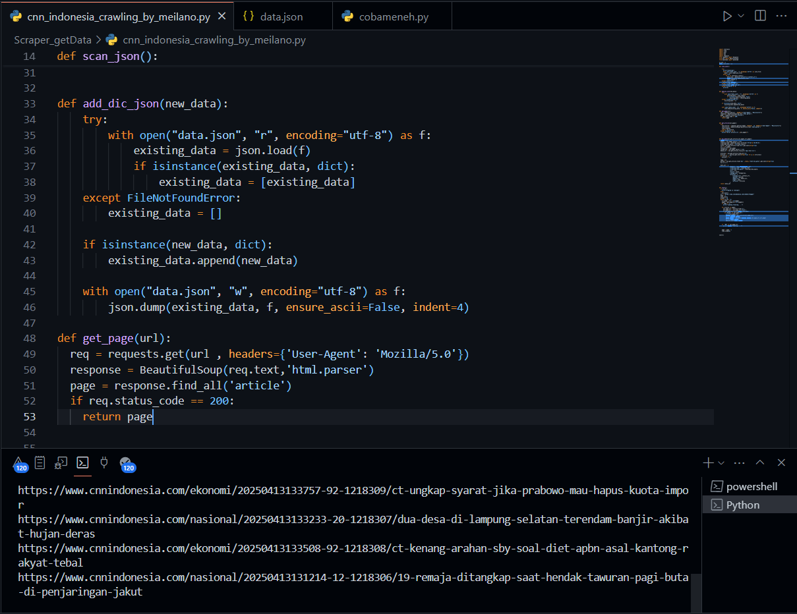
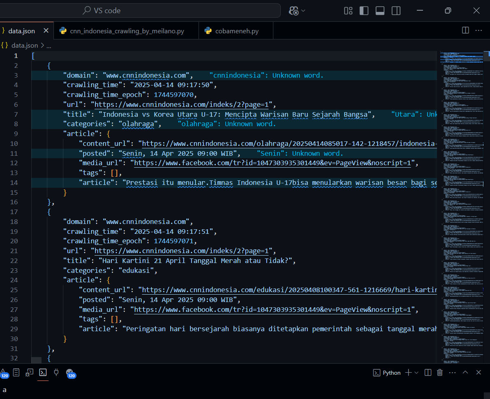

# HTTP Requests Sources

"https://www.cnnindonesia.com/indeks"

# DEMO / SCREENSHOOT
<a> Scan data apakah sudah ada yang di crawling sebelumnya</a>

<a> Proses Scrap/Crawling</a>

<a>Hasil Scraping</a>

